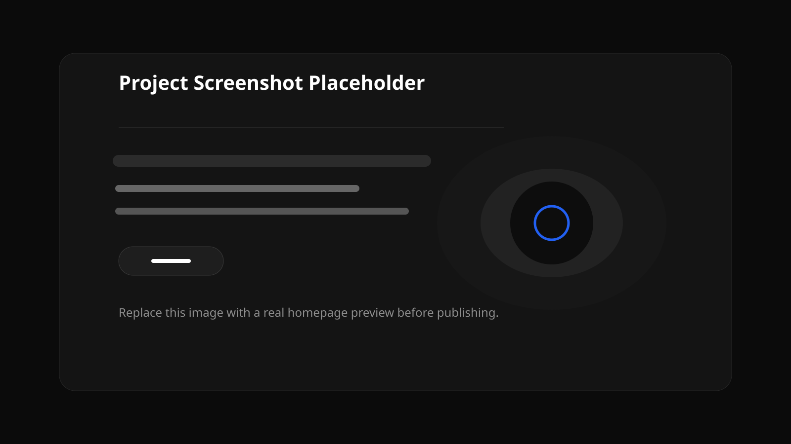

# Forge One — Hardware Customization & Prototyping

Premium, cinematic single-page company website for a hardware customization studio focused on bespoke development, rapid prototyping, 3D-printed enclosures, and monitoring systems.



## Live Demo

Add your deployed link here: `https://your-demo-url.example`

## Tech Stack

- HTML5
- CSS3
- Vanilla JavaScript

## Features

- Premium dark product-showcase aesthetic inspired by the supplied reference image
- Full-width responsive layout optimized for desktop, tablet, and mobile
- Sticky header with mobile overlay navigation
- Centered hero hardware render with layered background typography
- Zig-zag section rhythm for prototyping, enclosures, and monitoring
- Smooth reveal animations, hover transitions, and rotating badge detail
- Relative asset paths suitable for GitHub Pages and static hosting

## Project Structure

```text
project-root/
├── index.html
├── assets/
│   ├── css/
│   │   └── styles.css
│   ├── js/
│   │   └── script.js
│   └── images/
│       ├── enclosure-case.svg
│       ├── hero-hardware.svg
│       ├── monitoring-system.svg
│       ├── preview-placeholder.svg
│       ├── promo-hardware.svg
│       └── prototype-module.svg
├── .gitignore
├── LICENSE
└── README.md
```

## How to Run Locally

1. Download or clone the repository.
2. Open `index.html` directly in your browser, or serve the folder with a static server.
3. Optional local server example:

```bash
python3 -m http.server 8000
```

Then visit `http://localhost:8000`.

## Asset Workflow

- Put new images, icons, fonts, or graphics inside `assets/`.
- Keep file references relative, for example: `assets/images/your-file.png`.
- After adding assets, verify they are linked from `index.html`, `assets/css/styles.css`, or `assets/js/script.js` as needed.

## Notes

- The social and contact-style links are static placeholders for now.
- The preview image is a placeholder; replace it with a real screenshot before launch.
